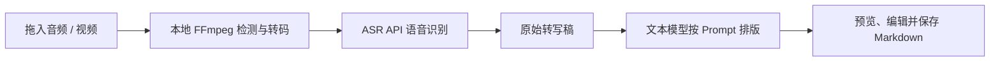

<p align="center">
  
</p>

<h1 align="center">声织笔记</h1>

<p align="center">
  把播客、会议、课程、访谈和直播，变成可编辑、可保存的 Markdown 知识资产。
</p>

<p align="center">
  本地处理媒体，自选 AI 接口，轻度清理口语并保留约 70%-80% 原文，而不是只生成一份高度压缩的摘要。
</p>

<p align="center">
  Windows · Electron · FFmpeg · ASR · Markdown
</p>

## 项目简介

声织笔记是一款面向内容创作者、学生、研究者和团队的本地优先 Windows 桌面应用。用户拖入音频或视频后，软件在本机完成媒体检测和音频预处理，再调用用户自行配置的 ASR 与文本模型 API，最终生成适合 Obsidian、Logseq 或本地知识库使用的 Markdown 文档。

它不只提炼摘要。内置 Prompt 会先为每个主题写简短总结，再保留约 70%-80% 的正文原话，并在文末整理金句、重点、反馈和关键数据。

当前版本：`v0.2.17`

## 核心流程



## 功能亮点

- 支持批量拖入文件，并用 FFprobe 检测真实媒体内容和音轨。
- 支持 70+ 种常见音视频扩展名，未知扩展名也会尝试按内容识别。
- 任务严格按队列顺序逐个处理，降低 API 并发超时和限流风险。
- 支持开始、暂停、继续、拖动排序和右键移除。
- 长音频自动切片，接口限流时自动等待并重试。
- 内置直播复盘、访谈、演讲稿、博客、播客、发布会、会议和课程笔记模板。
- 每个任务锁定当次 Prompt，避免模板选择和实际调用不一致。
- 长 Markdown 在固定预览区内独立滚动，可修改后再保存。
- 失败任务记录文件名、大小、阶段、耗时、模型信息和错误原因。
- 首次启动引导配置模型，后续按需打开设置。

## 适用场景

- 创作者：把播客、直播和访谈沉淀为内容素材。
- 学生：把课程和讲座整理为结构化学习笔记。
- 研究者：把音视频资料保存为可检索的来源笔记。
- 产品与创业团队：整理会议、发布会和用户访谈。
- 个人知识库用户：把长期积累的媒体文件转成可链接的 Markdown。

## 内置模板

- 直播复盘
- 访谈
- 演讲稿
- 博客 / 文章
- 播客
- 发布会
- 会议
- 课程笔记
- 自定义 Prompt

所有内置模板遵循同一原则：轻度清理口误、停顿和机械重复，不把正文压缩成摘要，尽量保持原始表达和上下文。

## 支持格式

常见视频格式：

`MP4`、`M4V`、`MOV`、`QT`、`MKV`、`WEBM`、`AVI`、`WMV`、`ASF`、`FLV`、`F4V`、`TS`、`MTS`、`M2TS`、`MPEG`、`MPG`、`VOB`、`OGV`、`3GP`、`MXF`、`DV`、`RM`、`RMVB` 等。

常见音频格式：

`MP3`、`MP2`、`WAV`、`M4A`、`AAC`、`FLAC`、`OGG`、`OPUS`、`WMA`、`AMR`、`AIFF`、`CAF`、`APE`、`MKA`、`AC3`、`DTS`、`AU`、`DSF` 等。

最终兼容性取决于内置或系统 FFmpeg 是否能读取对应容器和编码，以及文件中是否存在音频轨道。

## 模型接口

ASR：

- OpenAI `/audio/transcriptions` 兼容接口
- 小米 MiMo ASR
- 豆包 / 火山引擎 ASR
- 讯飞听见长音频转写
- OpenAI Chat 音频输入兼容接口
- Anthropic-compatible 音频输入实验模式
- 自定义 OpenAI-compatible ASR

文本排版：

- OpenAI-compatible Chat Completions
- Anthropic Messages
- OpenAI、DeepSeek、通义千问、豆包等供应商预设

模型和接口可能随供应商调整。应用支持从接口刷新模型列表，也允许手动填写实际开通的模型名。

## 隐私边界

- 媒体检测和转码在本机完成。
- 音频会发送到用户配置的 ASR 服务。
- 转写文本会发送到用户配置的文本模型服务。
- API Key、错误日志、中间音频和转写稿保存在本机，不应提交到仓库。

因此，“本地优先”不等于“完全离线”。处理敏感录音前，请确认已获得授权，并了解所选 API 服务商的数据政策。详见 [SECURITY.md](SECURITY.md)。

## 本地开发

环境要求：

- Windows 10 / 11 x64
- Node.js 20 或更高版本
- FFmpeg 和 FFprobe

安装依赖并检查源码：

```powershell
npm ci
npm run check
```

开发运行：

```powershell
npm start
```

FFmpeg 可以安装到系统 `PATH`，也可以把 Windows 版文件放入：

```text
resources/ffmpeg/ffmpeg.exe
resources/ffmpeg/ffprobe.exe
```

源码检查不要求仓库包含这两个大文件。处理媒体或构建完整安装包时必须提供它们。

## Windows 打包

```powershell
npm run check:release
npm run dist
```

生成的安装包位于 `outputs/installers/`。安装包、FFmpeg 和 FFprobe 不进入 Git 历史；对外发布时把安装包上传到 GitHub Releases。

## 项目结构

```text
src/
  main/                  Electron 主进程、IPC 和服务
  renderer/              桌面界面与交互
resources/
  icons/                 应用图标
  ffmpeg/                本地构建时放置 FFmpeg/FFprobe
scripts/
  check.js               源码与发布前检查
docs/
  OBSIDIAN_WORKFLOW.md    知识库工作流建议
  RELEASE_TEMPLATE.md    GitHub Release 文案
  GITHUB_SUBMISSION.md   公开提交与比赛展示清单
```

## 验证

- `npm run check`：检查源码结构、关键交互约束和 JavaScript 语法。
- `npm run check:release`：在源码检查基础上确认图标、FFmpeg 和 FFprobe 已就绪。
- GitHub Actions 会在 push 和 pull request 时运行源码检查。

## Obsidian 工作流

推荐先把生成文档保存到 Vault 的 Inbox，再补充标签、双链、来源和个人思考。完整建议见 [docs/OBSIDIAN_WORKFLOW.md](docs/OBSIDIAN_WORKFLOW.md)。

## 发布与黑客松展示

- GitHub 提交和隐私检查：[docs/GITHUB_SUBMISSION.md](docs/GITHUB_SUBMISSION.md)
- Release 文案：[docs/RELEASE_TEMPLATE.md](docs/RELEASE_TEMPLATE.md)
- 项目介绍素材：[docs/LAUNCH_KIT.md](docs/LAUNCH_KIT.md)

## 当前限制

- 当前主要面向 Windows。
- 需要用户自行提供 ASR 与文本模型 API。
- 实际费用、速率和数据处理方式由 API 服务商决定。
- 仓库不提供 FFmpeg 二进制和安装包，成品请通过 Releases 分发。

## License

[MIT](LICENSE)
